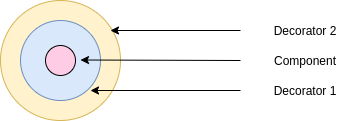

# Decorator

#### What is it?
Provides the ability to change method behaviour without actually changing it. The way this is done is by introducing another object - a decorator which wraps the object which is the destination for the message. The method goes through the wrapper instance, and it redirects it to the actual destination. On return the same process is done, but it in reverse order. Decorators can be nested into each other. This gives the special trait that the decorator object is both `is-a` and `has-a` because it can behave as a component and as a wrapper - they are interchangeable.

This pattern attaches additional responsibilities dynamically. Flexible alternative of subclassing - a way of using composition over inheritance for sharing behaviour.

The patter is completely agnostic to the specific case it is used for.

#### Example

Let's say there's a `Library` class. There we store `LibraryItem`'s, but these items can be different - `Book`, `Video`, `Collectible`, etc. Some of these we can borrow and they become also - `Borrowable`. 

In order to not have a _class explosion_  the `Decorator` pattern may be used. 

This is approached by declaring a `Component` class, or in the specific case - an abstract class `LibraryItem`(or an interface, depending on the specific situation). After that `ConcreteComponent` classes are added, in the specific case - `BookComponent`, `VideoComponent` and `CollectibleComponent`. Now there is the fundamental part of the system. In order to have the ability to attach responsibilities dynamically, we need one more pair of interface-subclass. These are the `Decorator` interface and the `ConcreteDecorator`, or in this specific case - `LibraryItemDecorator` and `BorrowableDecorator`.

With this design a `LIbraryItem` can always be wrapped in the decorator `BorrowableDecorator`.

------

**Key takeaway:** The `Decorator` is in the interesting state where both `is-a` and `has-a` (related to `Component`) are correct.

-------------

#### Diagrams

-------------

