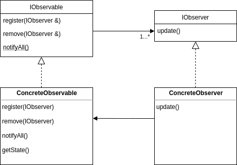

# Observer Pattern

#### Example

 Suppose there are two objects. One of them changes state, and the other one _needs_ to now when the first one's state changes. Let's call them A - the observable, and B - the observer.

 **Push** vs **Poll**
 - the straight-forward solution would be to ask 'A' whether its state has changed; but how often should B ask?; and what if there are many B's, should they all ask? _this is called polling_; B is _polling_ for data
 - instead, _pushing_ is used: it's A's responsibility to notify the other device(B or many B-s) on each change of state
 - **BUT** A needs to know all B-s which must be notified

 _Note:_ A is sometimes referred to as the _subject_.

 **Definition:** Observer defines a one-to-many relationship between objects, so that when the observable changes state, all observers are notified and updated automatically.

#### Components

There are 2 base interfaces: `IObservable` and `IObserver`. 

The first one provides 3 basic methods: `addObserver`, `removeObserver` and `notifyAll`. The implementation of `IObservable` should provide a collection which will store all observers. With `addObserver` a observer is added to the collection and with `removeObserver` - one is removed from it. The last method - `notifyAll` has the responsibility to iterate over the collection and notify the concrete observer.

The second one - `IObserver`, declares the method `update`. The `notifyAll` method in the `IObservable` calls `update` on each observer. This way the specific observer are responsible for whatever they want to do when the state has changed in some way.

#### Concretion

Let's have 2 subclasses implementing the interfaces just described: `ConcreteObservable` and `ConcreteObserver`. 

To the `ConcreteObservable` should be added some methods such as `SetState`, `GetState`, etc. (This depends on the specific case. Also note that `ConcreteObservable` might be breaking the single-responsibility rule.)

#### Bonus

One more relationship may be introduced. The `ConcreteObserver` might store a reference to the `ConcreteObservable` which is being observed. This way the `update` method does not need to get as parameter the `IObservable` which has changed state. Also this provides the `ConcreteObserver` with the rights to access the state of the `ConcreteObservable` in order to get specific information about the change of state.

#### Example

Observable - A weather station
Observer - Displays

The weather station implements the `IObservable` interface and other then the methods provided, id defines `getTemperature`.

Also, let's say, there are 2 different types of displays - `PhoneDisplay` and `LCDDisplay`, which implement the `IDisplay` interface. And the displays implement `IObserver` as well.

----
#### Diagram

