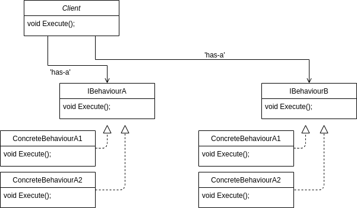

Strategy Pattern
--------------------------

- one of the simplest patterns
- using composition rather than inheritance;
understanding that inheritance is not suitable for code reuse

**Definition:** Strategy defines a family of algorithms. It encapsulates each one of them and they are interchangeable. Strategy lets the algorithm vary independently from the clients that use it. 
 
**Takeaway message:** The algorithm is decoupled from the clients which use it.

Think about a collection. If it has a sorting algorithm implemented in it. Then the sorting algorithm cannot be changed easily, but if we decouple the sorting algorithm from the collection implementation we can plug-and-play with different algorithms for sorting.

Example
------------------

Assume there is a base class `Duck`. There are two subclasses which inherit from the base - `WildDuck` and `CityDuck`. The subclasses are responsible for the implementation of the `display()` method and the implementation of `quach()` is shared for all subclasses. But let's say there is also a static method `fly()` and after some time of using the system as it is, a new subclass is added - a `RubberDuck`. And it has a derived implementation of `fly()`... And after that a new subclass appears - a `MountainDuck`, and this type of duck has a different type of flying behaviour. And after that another duck is added and it has the same flying behaviour. Well, now the need for a class about the flying behaviour becomes obvious. 

The problem in a nutshell here is this: if we have a common behaviour shared in vertical direction of the hierarchy, we are fine. But as soon as the common behaviour appears on a horizontal level (one duck type shares behaviour with another one, but not with every duck type there is), there comes the need for a better solution then inheritance.

> The solution to problems related to inheritance is not more inheritance. -- Some smart guy

If we cannot create a hierarchical solution in order to share code (_inheritance_), we need to extract (composition) the algorithms and use the subclasses as clients.

Solution
----------------------

Each `Duck` derived class is a client. They make use of different algorithms for `quach`-ing and `fly`-ing.

One way of approaching this is by creating two interfaces: `IQuachBehaviour` and `IFlyBehaviour`. They define the signatures of their methods. Notice that instead of two separate interfaces, only one may be used e.g. `IDuckBehaviour`.

Here 'is-a' is used and not 'has-a', meaning that each `Duck` derived _must_ have defined `quach` behaviour and defined `fly` behaviour. Notice that `IQuachBehaviour` and `IFlyBehaviour` are interfaces aka instantiation is not possible and a subclass has to be added - e.g. `SimpleQuach` for `WildDuck`, `NoQuach` for `RubberDuck`; `SimpleFly` for the `MountainDuck` and `JetFly` for the `EngineerDuck`.

**NB:** A good naming convention for this pattern may be used: e.g. instead of `IQuachBehaviour`, `QuachStrategy` may be used in order to help the developer notice the design pattern used in the specific case.

Diagram
--------------

