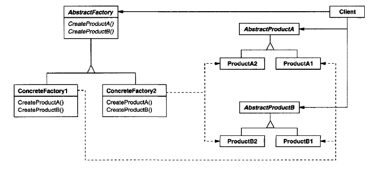

Abstract Factory Pattern
----------------------------
_also known as **Kit**_

**Intent**

Provides an interface for creating families of related or dependent objects without specifying their concrete classes.

**Example**

Consider a user interface that supports several different look-and-feel standards, e.g. let's say Mac, Windows and some Linux distributions. In order to make this UI usable in different envirements there needs to be a single way of creating objects without specifying a concrete class in order to provide a polymorphic interface for instantiation. This could be done using the `Abstract Factory` design pattern.

**Components**

In order to implement this pattern in the most flexible way, several classes are needed. Let's being with the `Factory` 'tree'. There is an interface - let's call it `IAbstractFactory`. It is implemented by `ConcreteFactor(y)`- ies. In our case `IAbstractFactory` defines the signature for instantiation and the different `ConcreteFactory` - ies implement this signature with their specific look-and-feel standards, so one `ConcreteFactory` is needed for Mac, one for Windows, and several for the different Linux distributions.

One other tree needs to be provided. This is the `IAbstractProduct` tree. Our `IAbstractFactory` handles `IAbstractProduct` instances which define the product signature. This signature must be implemented for the specific `ConcreteProduct`-s.

Important note to make is that the products are used in combination i.e. a widget from the Windows theme would not make any sense with a button from the Linux Mint theme. This aspect of the pattern is thought of when said _"families of related or dependent objects"_.

TL;DR there are `AbstractFactory` and `AbstractProduct` which provide the interface which the `ConcreteFactory` and `ConcreteProduct` implement in order to get the desired results (in the example case - different UI themes, without _class explosion_).

**Applicaility**
_or when to use?_

- a system should be independent of how its products are created, composed and represented
- a system should be configured with one of multiple families or products
- a family of related products is designed to be used together, and you need to enforce this constraint
- you want to provide a class library of products, and you want to reveal just their interfaces, not their implementations

------------

**Diagram**

