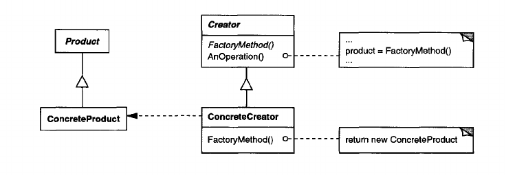

Factory Method Pattern
------------------
_also know as **Virtual Constructor**_

**Intent**

Define an interface for creating an object, but let subclasses decide which class to instantiate. Factory Method lets a class defer instantiation to subclasses.

**Example**

Let's say we are developing a framework for presenting different types of documents to a user application. Here there are 2 key abstractions - the `Application` and the `Document`. They are used by implementing (or subclassing) in order to realise the specific implementation which is needed. The `Application` is responsible for managing documents - creating, opening, etc. So this creates a dilemma: the framework is responsible for instantiating classes, but it only knows about the abstract classes, which cannot be used.

This problem can be solved with the Factory method problem.

There are the interfaces `Application` and `Document`. They are implemented by concretions - `ConcreteApplication` and ` ConcreteDocument`. The `Application` defines the signature for using the `Document` - prototypes for methods: `CreateDoc()`, `NewDoc()`, `OpenDoc()`, etc. This signatures are then implemented for the concrete `Application` and its `Document` (possibly more then one type).

**Components**

The general scheme for this pattern can be composed by the following types: there is a `IProduct` and a `ICreator`. The creator interface provides the signature for instantiating a product. These 2 interfaces get implemented by concretions - `ConcreteProduct` and `ConcreteCreator` which are responsible for providing realisation for the specific implementation.

**Applicability**
_or to use when_

- a class can not anticipate the class of objects it must create
- a class wants its subclasses to specify the objects it creates
- classes delegate responsibility to one of several helper subclasess, and you want to localize the knowledge of which helper subclass is the delegate

-------

**Diagram**

