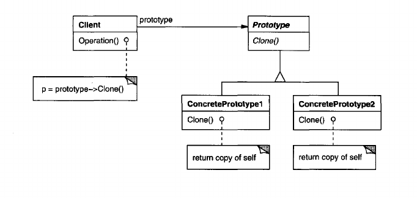

Prototype Pattern
----------

**Intent**

Specify the kinds of objects to create using a prototypical instance, and create new objects by copying this prototype, without coupling to their specific classes.

In short, it allows you to create a copy of an existing object and modify it to your needs, instead of going through the trouble of creating an object from scratch and setting it up.

**Example**

Suppose we are implementing a framework for graphical editing. Let's assume out framework provides an abstract class `Graphic` which is responsible to the graphical components, `Tool` for defining tools (such as palette operations), and also a `GraphicTool` which creates instances of graphical objects.
But this presents a problem for the framework design, because what is going to be represented graphically is specific to the application and the `GraphicTool` belongs to the framework.

The solution here is simple. The `GraphicTool` will create new `Graphic` instances by cloning an instance of the `Graphic` subclass. `GraphicTool` is parameterized by the prototype it should clone and add to the document e.g. All `Graphic` subclasses must support cloning and must provide their implementation of the `Clone` operation. Then the `GraphicTool` will be able to clone any kind of `Graphic`.

**Components**

In the implementation of this pattern there are several classes. There is the `IPrototype` class which could be either an interface, or an abstract class. A `ConcretePrototype` is the one subclassing `IPrototype`. It has the responsibility to provide an implementation for the cloning operation. And after that, there is the `Client` which uses the other by creating a new object by asking the prototype to clone itself.

**Applicability**
- when the classes to instantiate are specified at run-time
_or_
- to avoid building a class hierarchy of factories that parallels the class hierarchy of products
_or_
- when instances of a class can have one of only a few different combinations of state; it may be more convenient to install a corresponding number of prototypes and clone them rather than instantiating the class manually, each time with the appropriate state

----------

**Diagram**

