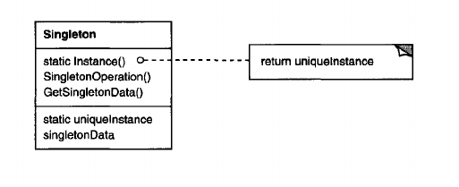

Singleton
============

**NB:**

Singleton is a very questionable design pattern. In some sense it can be more of a _code smell_ then a benefit.

_Why is that?_
1. It conflicts with the Single Responsibility principle (ch. SOLID for more information) by loading the class with 3 responsibilities - to make sure that there is only one instance of it, to provide a global point of access to it AND to perform its original duty (notice the singular form).
2. It does not really make sense in the major case - when are you 10012341230% certain that there is only one instance needed. Let's take an example: if we are building a chat application and we implement our chat room as a singleton, it will limit our development, because after some time we might want to introduce multiple chat rooms and then we would remove the singleton.

**Intent**

Ensure a class has only one instance, and provide a global point of access to it.

**Applicability**
_or to use when_

- there must be exactly one instance of a class, and it must be accessible to clients from a well-known access point
- when the sole instance should be extensible by subclassing, and clients should be able to use an extended instance without modifying their code

**Example**

1. A single president should be present for a country.
2. A single spooler directory should be present for a system.

**Components**

There are no external compoments. The singleton is implemented directly in the class we want to affect. This is done via one interesing mechanism - a private constructor and a public static method of the class. The static method can be called from outside but not the constructor, the static method also is able to call the private constructor and thus instantiate the class. If the class is already instantiated and we invoke the static method responsible for the singleton, the same instance which was created before should be returned.

------

**Diagram**

