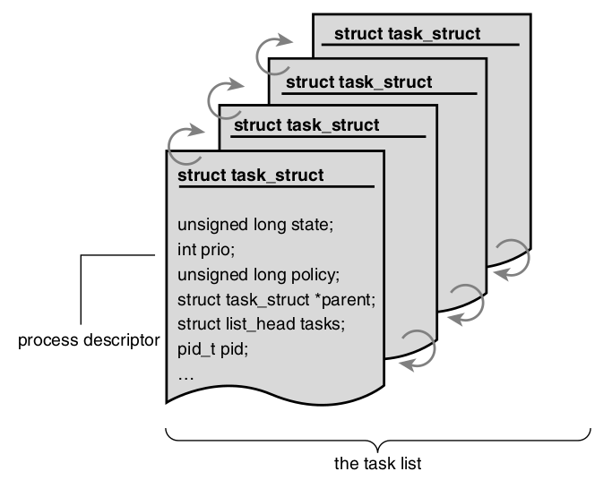

.. role:: c(code)
   :language: c

Linux Kernel Development
=================================

Process Management
------------------

The kernel does not an internal representation for threads. Actually it does not find threads to be that different then processes. 

All processes are stored in a doubly-linked list where each element is a descriptor of type ``struct task_struct``. Additionally each processes gets assigned an opaque unique identification called pid [#f1]_, which is used as an indexk

Usually when the kernel operates on processes, it accesses directly the ``task_struct`` of the target process. It is quite common to edit the values associated with a certain process, often that is the currently executing process. Henceforth, a mechanism for acquiring it is provided - the ``current()`` macro. Its implementation is architechture specific and depends on other factors discussed later.

In order to access the ``task_struct`` of a process, firstly the ``struct thread_info`` must be acquired and then access the other, which is pointed by one of the members of ``thread info``. It is usually stored at the bottom or the top of the kernel stack, or a pointer to it is stored in a register, depending on the specific arch.

Each process is in exactly one of the following states:

  * ``TASK_RUNNING`` - The task is in the run queue, meaning that it is either runable or actually running
  * ``TASK_INTERRUPTIBLE`` - The task is blocked and resides in a wait queue and awaits for a specific event, which will *interrupt* its sleep. Also, if it receives a signal, it might awake prematurely.
  * ``TASK_UNINTERRUPTIBLE`` - Same as previous but cannot wake up prematurely.
  * ``__TASK_TRACED`` - The task is being traced.
  * ``__TASK_STOPPED`` - The task is not allowed to execute. Usually follows a ``SIGSTOP`` or similar.

The transition is illustrated here:

The process state could be modified by the ``set_task_task()`` and ``__set_task_state()`` macros.

The first process (``pid = 1``) is named **init**. It starts executing at the last stage of the boot process. Its ``struct task`` is statically allocated (called ``init_task``).

Creation
^^^^^^^^

The operation of process initialization is twofold - first, ``fork()`` creates a child process with copied parent properties and data, and then ``exec()`` loads a new executable and starts executing it.

.. note::
       Instead of actually copying the parent's address space and other data, a Copy-On-Write methodology is used, meaning that until an actual write operation, the "copied" resources are actually shared between the parent and its child.

The callstack when executing ``fork()`` eventually looks like that:

        1. ``fork ()`` 2. ``clone ()`` 3. ``do_fork ()``
        4. ``copy_process ()`` -- This function performs the majority of the work

           1. It duplicates the descriptors of the parent (``struct task_struct``, ``struct thread_info``)
           2. Updates some of the values of these descriptors to initial or poison values
           3. Sets the process to ``TASK_UNINTERRUPTIBLE``
           4. Allocates a pid
           5. Depending on the passed flag configuration the resources are either shared or cloned.

.. note::
        As we mentioned earlier, threads and processes are not so different in kernelland in terms of representation. This is clearly seen here, ``clone(SIGCHLD, 0);`` is called from "regular" ``fork()``, whilst ``clone(CLONE_VM, CLONE_FS, CLONE_FILES, CLONE_SIGHAND, 0);`` is called when creating a thread.

In the kernel, there exist a notion of solely kernel-executing threads, which *do not* context switch into userland. Furthermore, they do not have their own address space (their ``mm`` pointer equals ``NULL``). All of them are forked off the ``kthreadd``. (The interface is defined in ``<linux/kthread.h>``).

Termination
^^^^^^^^^^^

Process termination is handled mostly by the ``do_exit()`` function (``kernel/exit.c``).

        1. Sets flag in the ``task_struct`` of the process which denotes that the process is exiting.
        2. Removes kernel timers associated with the process.
        3. Releases the address space. If the cound of processes which use it equals 0, it is also destroyed.
        4. Dequeue from IPC semaphores.
        5. Decrements the usage count of objects related  to file descriptors and other file system data.
        6. Stores a copy of the exit code.
        7. Notifies the parent of the process' untimely demise.
        8. Calls ``schedule()``, which performs a context switch. The process never gets scheduled again, and therefor it never returns from the ``schedule()`` call.

A problem arises when the parent exits before the child, the child will forever remain a zobie. The solution is to reparent either to another process from the same thread group, or to the ``init`` process itself.

.. rubric:: Footnotes

.. [#f1] An opaque type is a type whose concrete structure is not exposed, enforcing information hiding.

Process Scheduling
------------------

The fundamental decision which the scheduler has to make is the following: Given a set of processes, which one should execute now?

Multitasking - the art of interleaving execution of multiple tasks, is based on either *preemptive* or *cooperative* multitasking scheme.

Preemptive multitasking
        The scheduler has full control over which process executes and when it executes. It has the power to cease the execution of process A and to resume the execution of process B, and then to repeat this same action with it after some time. This involuntary suspencion is called preemption.
        This mechanism is based on a value (usually referred to as *timeslice* or something along the lines), which represents the amount of time which the process has to execute. The timeslice may be preset or dynamically calculated.

Cooperative multitasking
        Rather than having full control over the current process, the scheduler delegates these power to each and every process. Instead of being forced to "pause" (or rather - directly suspended), the process decides on its own when to *yield*, when to allow other processes to get some CPU time. The negative possibilities are apparent - a process may decide not to yield... ever.

.. note::
        For the couple decades systems utilizing cooperative multitasking are not prevalent. For obvious reasons.

Before Linux 2.6.23, the scheduler had not been transformed since its original implementation. **TODO: Add description of original scheduler**. The transformation resulted in what is nowadays known as the O(1) scheduler. It improves on the limitations of the original scheduler, by introducing a constant-time algorithm for timeslice calculation, as well as adding per-processor run queues.

However, although the O(1) completety outperforms the previous scheduler in regular tasks, when it comes to interactive programs (ones which expect used input, i.e desktop applications), it was kind of bad. Therefoce a new concept turned up and it resulted in the `Completely Fair Scheduler <https://en.wikipedia.org/wiki/Completely_Fair_Scheduler>`_ which is currently being used.

Scheduler Policy
^^^^^^^^^^^^^^^^

These are the rules by which new processes are picked and ran. It has to satisfy two goals:
        1. Low latency
        2. High throughput

Each process could be classfied in one the following two categories:

I/O Bound
        Spend most of their time in submitting and waiting on I/O requests. Therefore, it is running (and runnable) for only short periods of time, because it has to block, while waiting for response. Example for I/O bound process is each and every GUI application ever.

or

CPU Bound
        Spend most of their time executing instructions. Generally executed until preempted (do not block often). An example is the program ssh-keygen.

.. note::
        Although most of the times processes are more of one type than the other, it could have characteristics of both.

Prioritizing
^^^^^^^^^^^^

A common scheme for scheduling is based on the processes' priority. Higher priority processes are scheduled first, followed by a round-robin walk-through of the low-priority (if they equal value, of couse). The higher priority value might denote either preference in scheduling or longer timeslices.

Linux implements two separate disjoint priority values - ``nice`` and ``real-time priority``. The first one marks how nice a process is to others, or how willing it is to allow others to go first. It is a value in the range [-20; 20) and the higher the value, the lower the priority. The ``real-time priority`` on the other hand is a value in the range [0; 100); the higher the value, the higher the priority. Usually, real-time processes have bigger values.

Timeslices
^^^^^^^^^^

The CFS caculates timeslices in a unique way - instead of assigning actual values (i.e 10ms), it gives each process a proportion of the CPU based on the priority. Therefore, ``timeslice = f(load of the system)``. Moreover, the resulting proportion is mapped with the nice value of the process, which acts as a weight to it. Rather then choosing which process to run based on its priority, the CFS makes this decision relative to the evaluted proportion, where smaller value, means higher chance of being picked.

.. note:: 
        Timeslice may also be called *quantum* or *CPU slice*.

Desired Results of CFS
^^^^^^^^^^^^^^^^^^^^^^^^^^^^^^^^^^^^^^^^^^^

Let's look at an example: two processes executing in the system. One is highly interactive, thus - I/O bound (P), whilst the other is entirely CPU bound (Q). Since, we would like P to run smoothly from the user-perspective it should have high respond time, meaning it - low latency. Adversly, since Q is much more time consuming than P, we would not take into account latency introduced by the scheduling policy, which means that P should be more prioritized.

In the beginning, the CFS should give each of the two processes 50% of the CPU. However, P waits wait more time than executing, meaning that Q gets more CPU time. Taking all of this into account it is clear that since P runs way less than Q, it should get prioritized when it needs to, when it is being used (remember, it is an interactive process). Therefore, the CFS gives each process a **fair** execution policy.

Several problems exist in the above-described scheme with which the CFS has to deal with:

Problem #1
        If we try to map the nice value to a timeslice (or %), we end up with a problem. Let's say that there are two processes - one with 0 nice and one with 20 nice. Let's also say that 0 nice corresponds to a timeslice of 100ms. With this config, the scheduler will give the first process 100 out of 105 ms and 5ms to the second. However if two processes with 20 nice value exist, each of them would get 5ms. In reality this is 50% of the CPU, but this is inefficient since there should be a context switch each 5ms.

Problem #2
        Two processes - 0 and 1 nice values. Let's say that 0 nice corresponds to 100ms timeslice. This means that the first process gets 100ms and the second - 95ms, which is a 5% difference. If we change the nice-timeslice mapping, to ``0 nice -> 10ms``, the processes get 10ms and 5ms respectively, which is a 50% difference. This means that "nicing a process down" has very different effects depending on the mapping.

Problem #3
        An ability to assign absolute timeslices is desired in kernel time. This is a metric based on the period of the timer tick.
        **TODO: Revisit after Ch. 11 and fill**

Problem #4:
        Handling process after wake-up - we would to give a fresly woken up process a higher chance of being scheduled in order to improve interactiveness of I/O bound programs, but this might result in a unfair amount of CPU time.

Pseudo-solutions
        * Geomtric nice values (instead of arithmetic)
        * Decoupled measurement mapping timeslices to timer ticks

Actual problem
        Assigning absolute timeslices yields a constant switching rate, but variable scheduling fairness.

Completely Fair Scheduling Algorithm
^^^^^^^^^^^^^^^^^^^^^^^^^^^^^^^^^^^^

Since Linux is kinda complex, it allows different scheduling algorithms to coexist and actually operate coherently. This is implemented via *sheduling classes*, where ach class reprents a different algorithm. Each of them is assigned a priority value that is used when the base scheduler chooses which concrete scheduler to perform its algorithm at a given time (higher priority means higher chance of being picked). Among all scheduler classes, the CFS is set as default (``SCHED_NORMAL`` within the kernel).

Perfect Multitasking
        Rather then running two processes each for 5ms while utilizing 100% of the CPU, in an ideal perfect multitasking CPU we run them for 10ms and each of them gets 50% of the CPU.

This model is impractictal since it does not take switching costs in account.

Firstly, the base proportion is calcaulted - ``1 / n`` (where ``n`` is the total # of processes). Following that, instead of *assigning* a timeslice to each process based on the nice value, CFS uses it to *weight* the proportion of CPU each process receives.

Targeted latency
        Approximation of the "infinetely small" scheduling duration.

The actual timeslice is calculated according to the target latency - if two tasks with equal priority exist, each of them will execute for 10ms, if five tasks with equal priority exists, each of them will execute for 4 ms, etc.

Minimum granularity
        The minimum amount of time a process may execute. (By default - 1ms).

.. note::
        With higher number of process, the timeslice each of them gets decreases. This means that with infinte # of process, each one of them will get <something-close-to-0> ms. Therefore, *minimum granularity* is defined as a bare-minumim for each process to execute. However, as the # of processes increases, the fairness of the scheduler drops.

Revisit Problem #2
        With two processes (0 and 5 as nice values) and ``target latency = 20ms``, then they will get 15ms and 5ms timelices respectively. If, they have 10 and 15 as nice values, the timeslices are again 15ms and 5ms respectively.

Implementation
^^^^^^^^^^^^^^

.. code-block:: c
        :linenos:
        :emphasize-lines: 11

        // include/linux/sched.h

        struct sched_entity {
                struct load_weight	load;
                struct rb_node		run_node;
                struct list_head	group_node;
                unsigned int		on_rq;

                u64                     exec_start;
                u64			sum_exec_runtime;
                u64			vruntime;
                u64			prev_sum_exec_runtime;

                u64			last_wakeup;
                u64			avg_overlap;

                u64			nr_migrations;

                u64			start_runtime;
                u64			avg_wakeup;

                u64			avg_running;
                [...]
        };

Virtual runtime - ``vruntime``
        The actual time that the process spent running (weighted) in nanoseconds. This is used to approximate the "perfect multitasking CPU". In the ideal case it would not be useful, since all of the processes would have gotten the same amount of the CPU share. There is some accounting needed in order to keep it up-to-date. It is implemented in the ``update_curr()`` function.

.. code-block:: c
   :linenos:

   // kernel/sched_fair.c

   static void update_curr(struct cfs_rq *cfs_rq)
   {
	struct sched_entity *curr = cfs_rq->curr;
	u64 now = rq_of(cfs_rq)->clock;
	unsigned long delta_exec;

	if (unlikely(!curr))
		return;

	/*
	 * Get the amount of time the current task was running
	 * since the last time we changed load (this cannot
	 * overflow on 32 bits):
	 */
	delta_exec = (unsigned long)(now - curr->exec_start);
	if (!delta_exec)
		return;

	__update_curr(cfs_rq, curr, delta_exec);
	curr->exec_start = now;

	if (entity_is_task(curr)) {
		struct task_struct *curtask = task_of(curr);

		trace_sched_stat_runtime(curtask, delta_exec, curr->vruntime);
		cpuacct_charge(curtask, delta_exec);
		account_group_exec_runtime(curtask, delta_exec);
	}
    }

.. note::
        As far as I see, there has not been a huge change until now (5.14.7). The only notable difference is that the ``__update_curr()`` function has been removed and its body has been incorporated directly inside ``update_curr``.

The above function is called periodically both when a process becomes eligible for running and when it gets blocked. Therefore, the ``vruntime`` is accurate.
Therefore, it directly maps the fairness with which the process has been treated, the algorithm for picking the next process to schedule becomes - choose the process with lowest ``vruntime`` value. Furthermore, the list of runnable processes is organised in a ``rbtree`` in order to efficiently locate the one with minumim ``vruntime`` value, so the actual "pick-next-process" operation becomes "go left until nothing is left" :). If has not been simplified enough, a tree walk isn't even required since the leftmost element is cached in the CPU runqueue (see ``__pick_next_entity()``).

.. code-block:: c
        :linenos:

        // kernel/sched_fair.c

        static struct sched_entity *__pick_next_entity(struct cfs_rq *cfs_rq)
        {
                struct rb_node *left = cfs_rq->rb_leftmost;

                if (!left)
                        return NULL;

                return rb_entry(left, struct sched_entity, run_node);
        }

.. note::
        If ``NULL`` is returned from ``__pick_next_entity()``, there are no schedulable processes and the idle process is ran.

The functions which add processes in the red-black tree are named ``enqueue_entity()`` - updates statistics, and ``__enqueue_entity()`` - actual tree modification. This is the same function which caches the leftmost element. It gets executed when a process gets runnable. Logically, ``dequeue_entity()`` and ``__dequeue_entity()`` are those who handle the entity removing logic, when a process blocks or terminates.

The entry point of the scheduler is ``schedule()`` function. This is the abstract high-level routine which everybody calls when they need to "do something with the scheduler". The most interesting thing that happens is the ``pick_next_task()`` function call which selects the next scheduler class to operate.

Waiting and Waking-Up
^^^^^^^^^^^^^^^^^^^^^

Processor blocking is implemented the following way:

        1. The task marks itself as sleeping
        2. Puts itself in a wait-queue
        3. Removes itself from the red-black tree
        4. Calls ``schedule()`` to select new process

Waking-up is the opposite - runnable, removed from wait-queue and added to the red-black.

Waiting in the kernel is usually done in the following way:

.. code-block:: c
        :linenos:

        // q is the wait-queue, we wish to sleep on
        DEFINE_WAIT(wait);

        add_wait_queue(q, &wait);
        while (!condition) { // condition is the event that we are waiting for
                prepare_to_wait(&q, &wait, TASK_INTERRUPTIBLE);
                if (signal_pending(current)) {
                        // handle
                }

                schedule();
        }

        finish_wait(&wait);

1. Instantiate an empty wait queue entry called ``wait``.
2. Add entry to wait queue (``wait -> q``).
3. Change process state to ``TASK_INTERRUPTIBLE`` or ``TASK_UNINTERRIPTIBLE``. Moreover, it may add the entry to the wait queue again if needed.
4. Catch *spurious wake ups* (one which was not caused by the occurance of the specified event).
5. If the condition is still not correct, ``schedule()`` is called. Then ``goto 3``.
6. Else, the process' state is switched to ``TASK_RUNNING`` and it's removed from the wait queue.

.. important::
        Usually real kernel code using this mechanism is not that simple. There might be (and almost always are) additional resources that require be taken care of.

.. caution::
        Just because a task is awakened does not mean that the event for which the task is waiting has occured; **Sleeping should always be handled in a loop that ensures that the condition for which the process is waiting has actually occurred**.

.. image:: _static/imgs/LinuxKernelDevelopment_2010_imgs/scheduler_states_relationship.png

Preemption and Context Switching
^^^^^^^^^^^^^^^^^^^^^^^^^^^^^^^^

Handled by the ``context_switch()`` function, which

1. Calls ``switch_mm()`` - Swaps memory mapping of processes
2. Calls ``switch_to()`` - Changes register values and other arch-specific states

Since the actual scheduling policy has to be invoked regularaly and not just manually by calling ``schedule()``, the actual mechanism is by marking a process as "to-be-preempted" - the kernel sets a ``need_resched`` flag on it (Actually this value resides inside the ``thread_info`` struct). This is done by the ``scheduler_tick()`` when the process has be to preempted and by ``try_to_wake_up()`` when a higher priority process needs to run. Some utility functions ...

============================       =================
Function                           Purpose
============================       =================
``set_tsk_need_resched()``         Sets flag
``clear_tsk_need_resched()``       Clears flag
``need_resched()``                 Checks flag value
============================       =================

User space preemption occurs when returning to userland either from an interrupt or from a syscall.
The Linux kernel is preemptive. This means that the kernel may preempt itself as long as its state allows it to do so. How do we decide whether it is safe or not? Locks. They are used as zoning markers. If no lock is being held, than the current piece of code being executed is fully reentrant.

This is implemented by a per-process ``preempt_count`` stored in ``struct thread_info``. Each time the process acquires a lock, the value is incremented, and each time a lock is released - decremented. This makes sure that when the value equals 0, the kernel is allowed to preempt the current kernel process.

.. note::
        From time to time, there might be the need to disable kernel preemption.

Real-Time Scheduling Policies
^^^^^^^^^^^^^^^^^^^^^^^^^^^^^

Other than ``SCHED_NORMAL``, the scheduling classes include ``SCHED_FIFO`` and ``SCHED_RR``. ``SCHED_FIFO`` always operates before ``SCHED_NORMAL`` and does not stop until the task is runnable. Furthermore, it does not utilize timeslices and does not impose time limits. ``SCHED_RR`` is similar to ``SCHED_FIFO`` with the single exception that it actually has execution time limits.

System Calls
------------

|
| **"Provide mechanism, not policy"**
|

Syscalls are the interface for the userland processes provided by the kernel.

The purposes of syscalls are handful. The majority of them are concerned with abstracting hardware resource, which on its own has a couple of benefits/purposes

        1. Security and stability
        2. Allows the kernel to implement virtualization subsystems - multitasking, VM, etc.
        3. Allows user processes to not care about internals

.. image:: _static/imgs/LinuxKernelDevelopment_2010_imgs/printf_to_write.png

.. note::
        The ``asmlinkage`` modifier notifies the compiler to look for the actual argumets only on the stack. Used with all syscalls.

First, each syscall is implemented inside the kernel as ``sys_{name}``. Each syscall is assigned what is known as a *syscall number*. The way that userland processes use to notify the kernel that they would like some kernel code to execute is by making a software interrupt (``int $0x80``). It directly triggers the execution of the system call handler - ``system_call()`` (defined in ``arch/include/asm/entry_64.S``). However, in order to execute the syscall, the kernel is also required to know the syscall number. In x86 this is passed through the ``%eax`` register. After the kernel traps, it simply maps the number to the corresponding syscall and is ready to execute it. Additionally, any arguments passed to the syscall are also transferred using registers. If there number exceeds the limit of 5, a pointer to the userland location where they are stored is passed instead. Return value is put into ``%eax`` as well.

Some of the problems related to syscalls are the following:

        1. Aging and Scalability - Once the syscall is implemented and other applications depend on it, there is no going back. Will this API stand the toll of time?
        2. Parameters - The syscall is kernel code - it has super-powers. How sure are you that **any** parameters passed to it will not damage or corrupt the system?
        3. Access Rights - Does the userland process have access to what it asks for?

.. note::
        Kernel code should never blindly follow userland pointers! If a copy has to be made, always use ``copy_to_user()`` or ``copy_from_user()`` depending on the situation.

.. note::
        Use ``<linux/capability.h>`` and its macro ``capable()`` to check whether a userland process has certain capabilities.

System calls are "registered" in libc by using macros defined in the kernel. If we are to register our new syscall - "myfun", it would look similar to that.

.. code-block:: c

   // kernel/sys.c

   int myfun(int num, int num2, const char *str);
   
   // lib.h

   #define __NR_myfun   283
   __syscall3(int, myfun, int, num, int, num2, const char *, str);

   // lib.c
   #include "lib.h"

   void foo(void) {
           int myfun_rc = myfun(1, 2, "hihi");
           ...
   }

Kernel Data Structures
----------------------

Linked Lists
^^^^^^^^^^^^

The kernel provides an intrinsic circular doubly-linked list implemented. It is defined in ``<linux/list.h>`` and provides a lot of functionlaities, including

        | ``list_add() list_add_tail()``
        | ``list_del() list_del_init()``
        | ``list_move() list_move_tail()``
        | ``list_splice() list_splice_init()``
        | ``list_entry()``
        | ``list_empty()``
        | ``list_for_each() list_for_each_entry()``
        | ``list_for_each_entry_reverse() list_for_each_entry_safe()``

Queues
^^^^^^

The kernel provides a queue implementation, defined in ``<linux/kfifo.h>``. Basic operations are
The size of the queue is required to be a power of 2.

        | ``kfifo_alloc() kfifo_init()``
        | ``kfifo_in() kfifo_out()``
        | ``kfifo_out_peek()``
        | ``kfifo_size()``
        | ``kfifo_destroy() kfifo_reset()``

Maps
^^^^

Not a general purpose map - is specifically designed to map userspace UID's to pointers. Additionally, it may also generate this UID. The struct is called ``struct idr``.

        | ``idr_init()``
        | ``idr_pre_get()``
        | ``idr_find()``
        | ``idr_remove()``

.. warning::
        The ``struct idr`` functions return 1 on success and 0 on error!

Trees
^^^^^

The kernel implementation of a binary tree is the red-black tree. In order for a binary tree to be considered red-black it has to satisfy the following properties

Black height of a red-black tree
        The number of all black nodes in a given path

        1. All nodes must be either red, or black
        2. All leaf nodes are black
        3. None of the leaf nodes store any data
        4. Each internal nodes have two children
        5. A red parent has two black children
        6. The black height is equal for every subtree

Red-black trees are considered "approximately-" or "semi-" balanced, since they do not corresponds to the definition. However, they still guarantee :math:`O(\log_{2})` complexity.

        | Binary tree is balanced if for each node that it holds, the number of nodes in the left subtree and the number of nodes in the right subtree differ by at most 1.

The kernel red-black tree API resides in ``<linux/rbtree.h>``. The interesting thing about it is that it does not provide an actual insert or search operation, in order to omit the usage of callbacks and comparison functions. This is what they should look like

.. code-block:: c

   #include <linux/rbtree.h>

   T *rbtree_search(V desired_inner_value) {
           struct rb_node *nod = [...];
           while (nod) {
                   struct T *val = rb_entry(nod, struct T, [...] /* container rbtree */);
                   if (val->inner_value > desired_inner_value) 
                           nod = nod->rb_right;              
                   else if (val->inner_value < desired_inner_value)
                           nod = nod->rb_left;
                   else
                           return val;
           }
           return NULL;
   }

   int rbtree_insert(T *entry) {
           struct rb_node **nod = &[...]
           struct rb_node *parent = NULL;
           struct T *temp = NULL;

           while (*nod) {
                  parent = *nod;
                  temp = rb_entry(*nod, struct T, [...] /* container rbtree */);
                  if (temp->inner < entry->inner)
                          nod = &(*temp)->rb_left;
                  else if (temp->inner > entry->inner)
                          nod = &(*temp)->rb_right;
                  else
                          return ERROR_ALREADY_APPEARS;
           }

           rb_link_node(nod, parent, temp);             // Actual insert modification
           rb_insert_color(nod, &[...]);                // Rebalancing
   }

Interrupt Handling
------------------

Interrupts replace polling, which incurs overhead. Rather than the CPU checking all hardware devices *once in a while*, each time a device needs "help" it notifies the CPU using an interrupt. Than the CPU signals the OS about the interrupt, which on its side starts executing the interrupt handler associated with the specific interrupt. Each interrupt has a unique number associated with it, in order to simplify the task of identifying the interrupt and its origin. They are often called IRQ lines. These interrupts are produced *asynchronously* by "external" hardware. There exist another type of interrups, often called exceptions, *synchrounous interrupts*, which are produced by the CPU. They are produced during program execution due to an error - division by 0, trap, page falut, etc.

The function that the kernel executes in order to handle an interrupt is usually abbreviated as *ISR* (= Interrupt Service Routine). It is part of the device driver. They run in a special *interrupt context* and it is unable to block, thus guarantying that the ISR is atomic. Since an interrupt may happen at any given time, it is important that the code inside the ISR executes quickly in order to return to other kernel operations. However, it is not uncommon that the ISR actually has to perform a lot of work (e.g network drivers).

Therefore, the interrupt processing is split into two

Top and bottom halves
        In the "top" - work is performed immediately upon receive, whereas the "bottom" is ran in a more convenient time. The top-half algorithm is implemented via the interrupt handler.

Firstly, an interrupt handler needs to be registered. This is done with the ``request_irq()`` function (``include/linux/interrupt.h``). One of its parameters is a callback to the handler implementation, which is of type ``irq_handler_t``, defined as

        :c:`typedef irqreturn_t (*irq_handler_t)(int, void *)`

where ``irqreturn_t`` is actually ``int``, but the typedef is required in order to preserve backwards compatibility.

.. note::
        The ``request_irq()`` may *block*. Therefore, it **should not** be called from an interrupt handler (it executes in atomic context).

At the end, handlers are freed using ``free_irq()``.

.. note::
        Interrupt handlers are not required to bee reentrant, since they execute in atomic context (as said before).

.. warning::
        Interrupts **interrupt** processes. They have to be quick and simple. They have to not call any blocking functions and should not busy wait. They hvae to not call functions which may leave the interrupt handlers, before being fully executed, since the scheduler cannot go back to the previous position in the irq handler. Moreover, during interrupts there is an per-CPU *interrupt stack* of 1 memory page.

Interrupts for the current CPU may be disabled and enabled using ``local_irq_disable()`` and ``local_irq_enable()``, but this is not very useful, since by using this pait of utilities, there is no guarantee that in interrupts were enabled in the beginning. Therefore, more common are ``local_irq_save()`` and ``local_irq_restore()`` which carefully handle the irq flags. Additionally, specific irq lines may be disabled and enabled - ``disable_irq()``, ``enable_irq()``.

.. note::
        If ``disabled_irq()`` is called two times, then in order to re-enable them, ``enable_irq()`` has to be called twice as well.

.. tip::
        If the work is
                
                * time sensitive or
                * related to the hardware or
                * required to execute in atomic context, without being interrupted

        put it inside the interrupt handler. For everything else - the bottom half will do. The fundamental question is "What *must* be in the top-half and what *can* be in the bottom half?".

Bottom halves
^^^^^^^^^^^^^

There are multiple of mechanisms used for deferring work from the interrupt handlers.

        1. ``softirq``
                Used for the most time-critical bottom halves. Usually involve a lot of careful and fine-grained locking. Allocated, prioritized and assigned statically. Then the softirq is *raised* at runtime, usually in the top half. All of the softirqs are checked and handled by ``do_softirq()``.

        2. ``tasklet``
                 Basically high-level softirqs - do not require difficult locking policies, but have less priority. The main difference compared to softirqs is that tasklets run on only CPU at a given time, whilst with there might be the case of two of the *same* softirqs executing concurrently on separate CPUs.

.. code-block:: c

        do_softirq()
        {
                u32 pending;
                pending = local_softirq_pending();
                if (pending) {
                        struct softirq_action *h;
                        /* reset the pending bitmask */
                        set_softirq_pending(0);
                        h = softirq_vec;
                        do {
                                if (pending & 1)
                                h->action(h);
                                h++;
                                pending >>= 1;
                        } while (pending);
                }
        }

Almost always tasklets are good enough for the job and only in extremeley rare cases softirqs are required.

An analog to raised softirq is the *scheduled tasklet*. This is implemented in ``tasklet_schedule()``

.. code-block:: c

        /*
         * Obviously pseudo-code :)
         */
        tasklet_schedule()
        {
                if (cas(tasklet->state, TASKLET_SCHED)) {
                        local_irq_save();
                        list_add(cpu.tasklet_vec, tasklet);
                        raise_softirq_with_disabledirq();
                        local_irq_restore();
                }
        }

The real operation is handled in the ``tasklet_action()`` function. The following is snippet illustrates its jobs.

.. code-block:: c

        tasklet_action()
        {
                local_irq_disable();
                struct tasklet *tasklet_list = list_extract(cpu.tasklet_vec);
                local_irq_enable();

                while (tasklet_list) {
                        if (tasklet_list->acquire()) {
                                if atomic (tasklet_list->count) // is it disabled?
                                        goto release;
                                tasklet_list->state = TASKLET_RUN;
                                tasklet_list->action();
                                tasklet_list = tasklet_list->next;
                        }

        release:
                        tasklet->release();
                }
        }

.. note::

        There are two types of tasklets - ``TASKLET_SOFTIRQ`` and ``HI_SOFTIRQ``. This effectively means that without being statically initialized, all takslets are *multiplexed* of these two softirqs. The ``HI_`` one has higher priority (ch. ``include/interrupt.h`` for the full priority enum).

There exist a per-CPU *ksoftirqd* thread which supports the handling of softirqs (thus tasklets as well). They are introduced as a compromise between two bad suggestions of handling re-raised softirqs

        1. Before returning from ``do_softirq()`` perform a check whether any of them have been raised again and execute them if that's the case.
                   * However, this is highly inefficient since this leaves the userland processes in a bad position - they will have a lot of latency and only interrupts and softirqs will ever execute.

        2. Do not treat re-raised softirqs specially - just wait until the next ``do_softirq`` call.
                   * However, this ultimately means that in most cases re-raised softirqs will be handled way to late since this will probably be on the next irq.

Taking all this into account, the kerneldevs add per-CPU kernel thread which looks after the softirqs but does not neglect the userland processes by setting the ksoftirqd's nice value to 19.

.. code-block:: c

        ksoftirq_main()
        {
                for (;;) {
                        if (!softirq_pending(cpu))
                                schedule();
                        set_current_state(TASK_RUNNING);
                        while (softirq_pending(cpu)) {
                                do_softirq();
                                if (need_resched())
                                        schedule();
                        }
                        set_current_state(TASK_INTERRUPTIBLE);
                }
        }

Work Queues
^^^^^^^^^^^

Different approach to the problem of deferring work.

* Do not execute in atomic context - may block
* Into threads, not processes
* Used in preferance to kernel threads
* Usually called worker threads - ``events/n``; per-CPU

.. image:: _static/imgs/LinuxKernelDevelopment_2010_imgs/workqs_impl.png
   :scale: 80%

Kernel Synchronisation
----------------------

General
^^^^^^^

Critical section
        Code areas which access shared data. **Unsafe.**

⇒  Atomics, otherwise *race condition* occurs.

Causes of concurrency in the kernel world

        * Interrupts, taskelts, softirqs
        * Sleeping and synchronisation with userland
        * SMP
        * Preemption

Primitives
^^^^^^^^^^

1. Atomic integer - :c:`atomic_t` (32-bit) and :c:`atomic64_t`
         * Instruction level sync primitives are used.
         * Many operations are supported, e.g ``atomic_set()``, ``atomic_get()``, ``atomic_inc()``. Notably, there exist a couple which perform multiple actions ``atomic_dec_and_test()``, ``atomic_inc_and_test()``, etc.

.. note::
        On most architectures a single word read is atomic. Thus, the ``atomic_read()`` has no additional complexities then just returning the value.

2. Atomic bitwise operations

         * Modifies bit values on opaque pointers.
         * ``test_and_set_bit()``, ``get_bit()``, etc.

.. caution::
        Non-atomic bit operation? Consider the case when a set, a following clear instruction are issued. At the end the bit will be 0, but there is no guarantee that it has ever been 1. This is the data race here.

3. Spin Locks
        * Only one thread of execution at a time holds the spin lock.
        * If another tries to acquire it while the spin lock is contended, the thread *spins*
        * Architecture specific. Arch-dependant code is in ``asm/spinlock.h``, while the kernel API resides in ``linux/spinlock.h``.
        * If the kernel is configured to not use preemption or the arch is not SMP, then spinlocks are compiled away completely.
        * Support "regular" API :). No surprises there.
        * Usually when working with spinlock, the code has to be cautious of bottom-halves, more specifically - whether there is shared data between the current thread of execution and bottom-halves. Thus, there is a function which stops bottom-halves while the spinlock is held, and another which does the opposite.
        * Reader-writer spinlock - ``rwlock_t``. Analogous to spin lock, **with the exception** of separate reader and writer lock/unlock, etc.

.. image:: _static/imgs/LinuxKernelDevelopment_2010_imgs/spinlock_api.png
   :align: center
   :scale: 50%

.. tip::
        **Rule of tumb** Lock data and not code!

.. warning::
        Linux' spin locks are not recursive - if a thread holding the spin lock, acquires it again, it is automatically in a deadlock.

.. note::
        Spin locks do not sleep - they busy wait. Thus, they might be used in atomic contexts (e.g interrupt handlers).

4. Semaphores
        * Sleeping locks
        * Well-suited for long-held locks
        * Only for process context
        * Multiple semaphore "holders"

                  - 1 holder: either mutex or binary semaphore (depending on the usecase)
                  - >= 2 holders: counting semaphore

                            + Enforce limits, but not mutual exclusion

        * Two primary operations - *Proberen* (test) and *Verhogen* (increment)

                  - The former decrements and acquries the semaphore, whereas
                  - the latter increments and releases the semaphore

        * ``struct semaphore``; ``sema_init()``, ``down_interruptible()``, ``up()``, ``init_MUTEX()``, etc.
        * Also reader-writer semaphore - ``struct rw_semaphore``

5. Mutex
        * Although, semaphores provide similar capabilities, ``struct mutex`` has simpler API and better performance.

.. tip::
        **Rule of tumb** Prefer ``struct mutex`` over ``struct semaphore`` (even with count limit 1).

.. image:: _static/imgs/LinuxKernelDevelopment_2010_imgs/mutex_api.png
   :align: center
   :scale: 50%

6. Completion Variable
        * Conceptually similar to semaphores. Thread A signals thread B when an operation *completes*
        * ``struct completion``; ``init_completion()``, ``wait_for_completion()``, ``complete()``
        * Check "sched.c" and "fork.c" for examples.

7. The Big Kernel Lock

        * Global spin lock. Yes... The idea was to ease the transition to fine-grained locking during the transition to SMP.
        * Peculiarities of the BKL

                  1. You can sleep while holding it.
                  2. Recursive lock.
                  3. Only in process context.

8. Sequential Locks
        * Used for accessing shared data.
        * On each write the sequence number is incremented (atomically). On each read the sequence number is checked before and after the operation. If they mismatch, then the read data is corrupted.

9. Barriers
        * ``rmb()``

                  - Read barrier. No reorders of *load()* operations pass the *barrier*

        * ``wmb()``

                  - Write barrier. No reorders of *store()* operations pass the *barrier*

        * ``mb()``

                  - Read & Write barrier

        * ``read_barrier_depends()``

                  - Only for subsequent loads on which this depends.
                  - Much quicker than ``rmb()``.

Timers and Time Management
--------------------------

Real-Time Clock (RTC)

        Chip which counts without stopping. Has additional battery in order to keep going while the machine is off.

System Timer

        Chip which interrupts the motherboard each *HZ* hertz

Jiffy (pl. Jiffies)

        The kernel notion of time. The number of ticks from the system timer since boot.

Timers

        Means for delaying work. Marks certain work to be executed after some time has passed (cannot guarantee that it is exactly precise, but only that is after at least the-given-period time).

Additionally work may be delayed using ``schedule_timeout(jiffies)`` which sleeps the task for *jiffies* time.

Memory Management
-----------------

Page
        The smallest unit of physical memory that the kernel operates on simply because the MMU does that (usually around 4K). Each and every page of physical memory has an associated ``struct page`` describing *not* its data, but its layout.

Zones
        The kernel cannot trat each page equaly, thus separates them into categories or zones. Each is represented as ``struct memzone``. There are a couple of them - the regular case is called ``ZONE_NORMAL``; there is also the memory used for DMA - ``ZONE_DMA``; the other important one is ``ZONE_HIGHMEM``. There existance is solely based on hardware limitations: DMA could be performed only on certain addresses (e.g ISA is 16-bit). Usually the layout is similar to the following - ``DMA < 16MB``, ``16MB < NORMAL < 896MB``, ``HIGHMEM > 896MB`` (x86-32).  Each zone is represented as ``struct zone``.

High memory
        Some of kernel memory is not permanently mapped - it cannot be addressed. Therefore, there is a memory zone called "high memory".

Allocating memory
^^^^^^^^^^^^^^^^^

There are a couple of different ways for memory allocation. Most of them rely on the page allocation API (check below), which is used for acquiring physical pages. The primary functions are used similarly to the userland ``malloc()``, but have a slight difference.

.. image:: _static/imgs/LinuxKernelDevelopment_2010_imgs/pagealloc_api.png
   :align: center
   :scale: 70%

.. caution::
        Unlike user-space, the kernel will happilly hang itself if you ask it!

gfp_t flags
        These are flags passed to the allocation functions, which denote the *modifiers* used - action (*how* to allocate), zone (*where* to allocate) and type (predefined combinations of *how* and *where*).

kmalloc()
        This is the equivalance the stdlib's malloc. Other than the required size, a second parameter is passed as well ``gfp_t flags``. Returns a physically contigous memory.

vmalloc()
        Same as ``kmalloc()``, with the exception that the memory is only virtually contigous, and not necessarily physically contigous.

At the end, memory is deallocated by calling the corresponding function - either ``kfree()`` or ``vfree()``, depending on the allocation policy.

Slab Layer
^^^^^^^^^^

Common phenomenon in kernel is keeping a *freelist*. This involves a preallocated pool of objects which get reused on "free" rather than actually freeing the memory. Thus, a general mechanism was introduced - the slab layer, which is basically a struct-caching layer.

The structure involves a cache, divided into multiple slabs, each of them composed of memory pages. Each slab contains some number of objects, which get cached. This results in 3 possible states - it is either full, empty or partial. When a request is made (allocation), a partial slab is used. If none exist, an empty is used, and if that does not exist as well, a new slab is allocated with the actual MM API.

*Slab API*

- ``mem_cache_create()``

- ``mem_cache_destroy()``

- ``mem_cache_alloc()``

- ``mem_cache_free()``

Map
        If a page is not mapped in kernel space but is required. The ``kmap`` function family is used. Additionally atomic variants are provided as well.

Virtual Filesystem
------------------

The kernel provides an abstracted view to any concrete filesystems that may be implemented until now and in the future. It wrapps the interface provided by them into a general one which is used by the other kernel components when talking to the filesystem layer. The following diagram illustrates this with an example utilizing FUSE.

Additionally, the VFS layer enables different filesystems to communicate with eachother, e.g copy FAT files to ext3.

.. image:: _static/imgs/LinuxKernelDevelopment_2010_imgs/vfs_flow.png
   :align: center
   :scale: 60%

.. note::
        The VFS layer is considered a good example of OOP implemented in C.

Summary
^^^^^^^

There are four primary objects which VFS recognises

        * **Superblock** - Specific mounted filesystem
        * **Inode** - File metadata
        * **Dentry** - Single path component
        * **File** - Opened file. Associated with a process

Each of them contains a related *operations* object.

        * **super_operations** - ``write_inode()``, ``sync_fs()``
        * **inode_operations** - ``create()``, ``link()``
        * **dentry_operations** - ``d_delete()``, ``d_compare()``
        * **file_operations** - ``read()``, ``write()``

For the most part, these methods may use the base implementation.

Each *registered* filesystem is represented as ``struct file_system_type``.

Each mountpoint is represented as ``struct vfsmount``.

.. warning::
        The UNIX fs concepts are physically mapped on disk. VFS is designed to work with these concepts, thus requiring each concrete filesystem to provide them. That is the case even for non-UNIX filesystem such as FAT or NTFS to provide the *appearance* of these concepts.

Superblock
^^^^^^^^^^

Represented as ``struct super_block`` from ``<linux/fs.h>``.

.. code-block:: c
   :linenos:

    struct super_block {
            struct list_head s_list;               /* list of all superblocks */
            dev_t s_dev;                           /* identifier */
            unsigned long s_blocksize;             /* block size in bytes */
            unsigned char s_blocksize_bits;        /* block size in bits */
            unsigned char s_dirt;                  /* dirty flag */
            unsigned long long s_maxbytes;         /* max file size */
            struct file_system_type s_type;        /* filesystem type */
            struct super_operations s_op;          /* superblock methods */
            struct dquot_operations *dq_op;        /* quota methods */
            struct quotactl_ops *s_qcop;           /* quota control methods */
            struct export_operations *s_export_op; /* export methods */
            unsigned long s_flags;                 /* mount flags */
            unsigned long s_magic;                 /* filesystem’s magic number */
            struct dentry *s_root;                 /* directory mount point */
            struct rw_semaphore s_umount;          /* unmount semaphore */
            struct semaphore s_lock;               /* superblock semaphore */
            int s_count;                           /* superblock ref count */
            int s_need_sync;                       /* not-yet-synced flag */
            atomic_t s_active;                     /* active reference count */
            void *s_security;                      /* security module */
            struct xattr_handler **s_xattr;        /* extended attribute handlers */
            struct list_head s_inodes;             /* list of inodes */
            struct list_head s_dirty;              /* list of dirty inodes */
            struct list_head s_io;                 /* list of writebacks */
            struct list_head s_moreio;             /* list of writebacks */
            struct hlist_head s_anon;              /* anonymous dentries */
            struct list_head s_files;              /* list of assigned files */
            struct list_head s_dentry_lr;          /* list of unused dentries */
            int s_nr_dentry_unused;                /* number of dentries in s_dentry_lru */
            struct block_device *bdev;             /* assiciated block device */
            struct mtd_info *s_mtd;                /* memory disk information */
            struct list_head s_instances;          /* instances of this fs */
            struct quota_info s_dquot;             /* quota-specific operations */
            int s_frozen;                          /* frozen status */
            wait_queue_head_t s_wait_unfrozen;     /* wait queue on freeze */
            char s_id[32];                         /* text name */
            void *s_fs_info;                       /* filesystem-specific info */
            fmode_t s_mode;                        /* mount permissions */
            struct semaphore s_vfs_rename_sem;     /* rename semaphore */
            u32 s_time_gran;                       /* granularity of timestamps */
            char *s_subtype;                       /* subtype name */
            char *s_options;                       /* saved mount points */
    };

One of the key members of the super's structure is ``s_op``, which is essentially a "vtable" of concrete fs' operations.

.. code-block:: c
        :linenos:

        struct super_operations {
                 /*
                  * create and init an inode under the given fs
                  */
                 struct inode *(*alloc_inode)(struct super_block *);            

                 /*
                  * deallocate given inode
                  */
                 void (*destroy_inode)(super inode *);                          

                 /*
                  * given inode is modified
                  * used for journaling
                  */
                 void (*dirty_inode)(super inode *);                            

                 /*
                  * write given inode to disk
                  * sync or async depending on wait
                  */
                 int (*write_inode)(super inode *, int wait);                   

                 /*
                  * called when the refcount = 0
                  * the inode is deleted
                  */
                 void (*drop_inode)(struct inode *);                            

                 /*
                  * delete inode from disk
                  */
                 void (*delete_inode)(struct inode *);                          

                 /*
                  * release superblock object; called on unmount
                  * s_lock has be held
                  */
                 void (*put_super)(struct super_block *);                       

                 /*
                  * synchronises the disk version with the memory version of a given superblock
                  * s_lock is required
                  */
                 void (*write_super)(struct super_block *);                     

                 /*
                  * synchronises fs metadata on disk with memory
                  * sync or async depending on wait
                  */
                 int (*sync_fs)(struct super_block *, int wait);                

                 int (*freeze_fs)(struct super_block *);
                 int (*unfreeze_fs)(struct super_block *);
                 int (*statfs)(struct dentry *, struct kstatfs *);
                 int (*remount_fs)(struct super_block *, int *, char *);
                 void (*clear_inode)(struct inode *);
                 void (*umount_begin)(struct super_block *);
                 int (*show_options)(struct seq_file *, struct vfsmount *);
                 int (*show_stats)(struct seq_file *, struct vfsmount *);
                 ssize_t (*quota_read)(struct super_block *, int, char *, size_t, loff_t);
                 ssize_t (*quota_write)(struct super_block *, int, const char *, size_t, loff_t);
                 int (*bdev_try_to_free_page)(struct super_block *, struct page *, gfp_t);
         };

Inode
^^^^^

Constructed in memory in a manner suitable for the concrete FS. Stores all required information in order to safely manipulate files and directories.

As with ``struct super_block``, there is an operations member.

.. code-block:: c
	:linenos:

	struct inode_operations {
		int (*create) ( ... );
		struct dentry *(*lookup) ( ... );
		int (*link) ( ... );
		int (*unlink) ( ... );
		int (*symlink) ( ... );
		int (*mkdir) ( ... );
		int (*rmdir) ( ... );
		int (*mknod) ( ... );
		int (*rename) ( ... );
		int (*readonly) ( ... );
		void *(*follow_link) ( ... );
		void *(*put_link) ( ... );
		void *(*truncate) ( ... );
		int *(*permissions) ( ... );
		int (*setattr) ( ... );
		int (*getattr) ( ... );
		int (*setxattr) ( ... );
		size_t (*getxattr) ( ... );
		size_t (*listxattr) ( ... );
		int (*removexattr) ( ... );
		void (*truncate_range) ( ... );
		long (*fallocate) ( ... );
		int (*fiemap) ( ... );
	};

Dentry
^^^^^^

.. code-block:: c
	:linenos:

	struct dentry {
		atomic_t 	d_count; 	/* usage count */
		unsigned int 	d_flags; 	/* dentry flags */
		spinlock_t	d_lock;		/* per-dentry lock */
		int		d_mounted;	/* is this a mount point */
		struct inode	*d_inode;	/* associated inode */
		struct hlist_node d_hash;	/* list of hash table entries */
		struct dentry 	*d_parent;	/* dentry object of parent */
		struct qstr	d_name;		/* dentry name */
		struct list_head d_lru;		/* unused list */
		union {
			struct list_head d_child;	/* list of dentries within */
			struct rcu_head	d_rcu;		/* RCU locking */
		} d_u;
		struct list_head	d_subdirs;	/* subdirectories */
		struct list_head	d_alias;	/* list of alias inodes */
		unsigned int 		d_time;		/* revalidate time */
		struct dentry_operations *d_op;		/* dentry operations vtable */
		struct super_block 	*d_sb;		/* superblock of file */
		void 			*d_fsdata;	/* fs-specific data */
		unsigned char		d_iname[DNAME_INLINE_LEN_MIN]; /* short name */
	};

Each entry is in one of the following states - either unsed, unused or negative.
	
	* Used - has a corresponding inode which is valid. There are valid users and cannot be discarded. (``d_count > 0``)
	* Unused - has a corresponding inode which is valid. No users (``d_count == 0``)
	* Negative - no associated inode (``d_inode == NULL``). It is kept around, so that future lookups could be resolved quickly.

Usually when a dentry name is resolved, there have been mulitple components in the path leading to it. Therefore, multiple "temporary" dentries have been resolved for (almost) nothing. Thus, the VFS keeps those in the *dcache*. It consists of three elements:

	* Used
	* LRU
	* Hashtable, mapping string path to dentry

Additionally, the dcache provides the frontend to the *icache*. As long as a dentry is cached, its associated inode is cached as well.

⇒ Locality
	1. Temporal - programs tend to access the same files, and
	2. Spatial - programs tend to access files from the same directory

.. code-block:: c
        :linenos:

                 struct dentry_operations {

                         /*
                          * called when fetching from the dcache to check if the dentry valid
                          */
                         int (*d_revalidate) ( ... );

                         /*
                          * hash the dentry
                          * called when placing in the dcache hashtable
                          */
                         int (*d_hash) ( ... );                 

                         /*
                          * compare two filenames
                          */
                         int (*d_compare) ( ... );              

                         /*
                          * called on d_count = 0
                          */
                         int (*d_delete) ( ... );               

                         /*
                          * free
                          */
                         void (*d_release) ( ... );             

                         /*
                          * if a dentry loses its inode (freed)
                          */
                         void (*d_iput) ( ... );                

                         char (*d_dname) ( ... );
                 };

File
^^^^

The in-memory representation of an open file.

.. code-block:: c
        :linenos:

         struct file {
                 union {
                         struct list_head fu_list;              /* list of file objects */
                         struct rcu_head fu_rcuhead;            /* RCU list after freeing */
                 } f_u;
                 struct path    f_path;                         /* contains the dentry - f_path.dentry */
                 struct file_operations *f_op;                  /* file operations vtable */
                 spinlock_t     f_lock;                         /* per-file struct lock */
                 atomic_t       f_count;                        /* usage count */
                 unsigned int   f_flags;                        /* specified on open */
                 mode_t         f_mode;                         /* access mode */
                 loff_t         f_pos;                          /* offset */
                 struct fown_struct     f_owner;                /* owner data for signals */
                 const struct cred      *f_cred;                /* file credentials */
                 struct file_ra_state   f_ra;                   /* read-ahead state */
                 u64            f_version;                      /* version number */
                 void           *f_security;                    /* security module */
                 void           *private_data;                  /* tty driver hook */
                 struct list_head       f_ep_links;             /* list of epoll links */
                 spinlock_t     f_ep_lock;                      /* epoll lock */
                 struct address_space   *f_mapping;             /* page cache mapping */
                 unsigned int   f_mnt_write_state;              /* debugging state */
         };

Filesystem Related Structs
^^^^^^^^^^^^^^^^^^^^^^^^^^

.. code-block:: c
        :linenos:

         struct file_system_type {
                 const char *name;      /* fs name */ 
                 int         fs_flags;  /* type flags */
                 struct super_block *(*get_sb) ( ... );         /* reads the superblock off the disk */
                 void           (*kill_sb) ( ... );     /* terminates access to the superblock */ 
                 struct module *owner;  /* owner of the fs */
                 struct file_system_type *next;
                 struct list_head fs_supers;    /* list of superblock objects */
                         
                 // runtime lock validation
                 struct lock_class_key s_lock_key;
                 struct lock_class_key s_umount_key;
                 struct lock_class_key i_lock_key;
                 struct lock_class_key i_mutex_key;
                 struct lock_class_key i_mutex_dir_key;
                 struct lock_class_key i_alloc_sem_key;
         };

Each file system gets on of these regardless whether it is even mounted at all. When it gets mounted, a ``struct vfsmount`` is created.

Process Related Structs
^^^^^^^^^^^^^^^^^^^^^^^

Each process has its own

        * Open files
        * Current directory
        * Root filesystem
        * Mount points

(and more actually).

There are a couple of structures which are used in order to tie VFS with a process.

.. code-block:: c
        :linenos:

        struct files_struct {
                atomic_t        count;          /* usage count */
                struct fdtable  *fdt;           /* pointer to other fdtable */
                struct fd       fdtab;          /* base fd table */
                spinlock_t      file_lock;      /* per-file lock */
                int             next_fd;        /* cache of next available fd */
                struct embedded_fd_set  close_on_exec_init;     /* list of close-on-exec fds */
                struct embedded_fd_set  open_fds_init;          /* list of open fds */

                /*
                 * If the process allocates morethen NR_OPEN_DEFAULT (usually 64),
                 * the fdt is allocated to point at a new array.
                 */
                struct file *fd_array[NR_OPEN_DEFAULT];
        };

.. code-block:: c
        :linenos:

        struct fs_struct {
                int    users;          /* user count */
                rwlock_t      lock;    /* lock */
                int    umask;
                int    in_exec;        /* currently executing a file */
                struct path root;
                struct path pwd;
        };

.. code-block:: c
        :linenos:

                 struct mnt_namespace {
                         atomic_t count;
                         struct vfsmount *root;
                         struct list_head list;
                         wait_queue_head_t poll;
                         int event;
                 };

.. note::
        When the ``clone()`` function is called and the ``CLONE_FS`` flag is specified, that addresses the ``struct fs_struct``. Similarly, there are also ``CLONE_FILES`` and ``CLONE_NEWNS`` (about ``struct files_struct`` and ``struct mnt_namespace`` respectively).

Block I/O
---------

Block device
        Random access of fixed-size chunk of data (blocks). Filesystems are mounted on such. (hdd, ssd, blueray, etc.)

Character device
        Stream of sequential data. (keyboard, serial port, etc.). Cannot call ``seek()`` on them.

The block I/O layer manages block devices and the access to them.

Block Device
^^^^^^^^^^^^

The smallest unit of memory in a block device is called *sector* (usually 512B). The software which manages the block devices imposes a logical size (usually 1K or 4K).

.. image:: _static/imgs/LinuxKernelDevelopment_2010_imgs/block_sector_mapping.png
   :align: center
   :scale: 75%

.. note::
        Sector size <= Block size <= Page size

.. tip::
        Sector and block do not have the same meaning. Sectors are called "*hard* sectors" and "*device* blocks" as well, whereas the logical blocks may be called "filesystem blocks" or "I/O blocks".

Buffer
^^^^^^

Each time an actual read from the physical storage is performed, the received block is stored in a buffer. Each buffer is associated with **exactly 1 filesystem block** and is its in-memory representation. Each buffer is referenced by a descriptor - ``struct buffer_head``. It stores information like the block device, the block number, etc.

.. code-block:: c
        :linenos:

        /*
         * <linux/buffer_head.h>
         */

         struct buffer_head {
                 /*
                  * BH_Uptodate
                  * BH_Dirty
                  * BH_Lock
                  * BH_Req
                  * BH_Mapped
                  * and (many) others
                  */
                 unsigned int b_state;

                 struct buffer_head *b_this_page;
                 struct page *b_page;
                 sector_t b_blocknr;
                 size_t b_size;
                 char *b_data;
                 struct block_device *b_bdev;
                 bh_end_io *b_end_io;
                 void *b_private;
                 struct list_head *b_assoc_buffers;
                 struct address_space *b_assoc_map;
                 atomic_t b_count;
         };

There is an issue with this model: when used for container for all I/O operations, the buffer_head forces the kernel to break up (pottentially) large block I/O operations (say, a write) into many buffer_head structures. Therefore, another struct appears at this level - ``struct bio``.

Bio
^^^

Represents block *already on the flight* as a list of segments. A segment is defined as a contiguous chunk in memory. Therefore, the individual buffers need not be contiguous in memory. This is called *scatter-gather I/O*.

.. code-block:: c
        :linenos:

        struct bio_vec {
        
                /*
                 * pointer to the physical page on which the buffer resides
                 */
                struct page *bv_page;
        
                /*
                 * the length of this buffer (bytes)
                 */
                unsigned int bv_len;
        
                /*
                 * the byte offset within the page where the buffer resides
                 */
                unsigned int bv_offset;
        };
