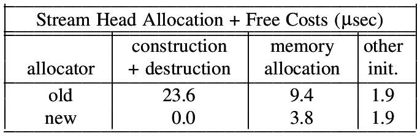
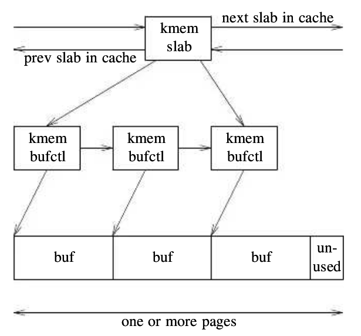

The Slab Allocator: An Object Caching Kernel Memory Allocator
=============================================================

*Jeff Bonwick, Sun Microsystems*

In kernel mode one of the most common operations are allocating and deallocating. Therefore, thay have to be fast. However, usually they include more overhead than needed and thus result in not so good performance. The primary problem in that us related to the construction and destruction of objects on every allocation. This allocator improves the others by maintaining a pool of preallocated and constructed instances, which do not get destroyed on each logical "free".

The core mechanism is based on not deallocating object each time, but to just return them to the cache. Thus, on "alloc" the cache will already have constructed and allocated instaces and will be responsible only for returning a pointer to the appropriate one, which minimizes overhead significantly.

Private Implementation?
-----------------------

        1. Tension between the global allocator and the private one
           
           - The former wants memory back, whereas the other wants to keep it.
           - The private allocator has no insights regarding the state of the global allocator
                     * For example, whether the global allocator has enough memory for other crucial components
           - The global allocator is not aware of the state of the private and cannot demand it to release its memory when needed

        2. The private allocator bypasses any debugging and monitoring mechanisms implemented for the global allocator

        3. Many solutions for the same problem

Design
------

Client Perspective
^^^^^^^^^^^^^^^^^^

The API consists of two steps - first, create a cache object for objects of type T, and, second - use it to allocate (more like "fetch") an instance of T.

.. code-block:: c
        
        struct cache *cache_create(
                char *cache_name,
                size_t cache_size,
                int align,
                void (*ctor)(void *, size_t),
                void (*dtor)(void *, size_t)
            );

        void *cache_alloc(struct cache *, int flags);

        void cache_free(struct cache *, void *buffer);

        void cache_destroy(struct cache *);
        

Allocator Perspective
^^^^^^^^^^^^^^^^^^^^^

* The slab allocator is not a monolithic entity, but rather a set of many caches for different object types
* Each cache maintains its own statistics and locking mechanism - there is no global one
* The benefit of knowing size of objects which will allocated before-hand results in optimal performace
* Slabs are the sinle primary unit of caches. Each time a cache needs to *actually allocate* memory, it gets an entire slab of objects, and when it needs to release memory - it releases a slab.
          
        - Each slab consists of >= 1 VM pages and a refcount.
        - When the refcount drops to 0, the slab is relinquished.

Therefore,

       (1) Reclaiming memory becomes easy
       (2) Allocating and freeing memory become trivial
       (3) Minimal external fragmentation
       (4) Minimal internal fragmentation

Each slab is associated with a ``struct kmem_slab`` which manages the inner buffers (or objects). Each buffer is represented as ``struct kmem_bufctl``, which store the freelist linkage, buffer address and the containing slab.

* Slab coloring

        - Each slab size could be expressed as: ``sizeof(aligned_object) * number_of_objects + number_of_unused_bytes + sizeof(slab_descriptor)``
        - Slab coloring is a scheme that attempts to have objects in different slabs use different lines in the cache. By placing objects at a different starting offset within the slab, objects will likely use different lines in the CPU cache, which helps ensure that objects from the same slab cache will be unlikely to flush each other. 
        - Slabs with differet colors store their first objects at different base offsets, while satisfying the alignment constraint
        - The total number of colors equals ``(number_of_unused_bytes / alignment) + 1``
        - ``base_offset_inside_slab = color[i] + sizeof(slab_descriptor)``

.. note::
        In Linux ``base_offset_inside_slab`` is the `colour_off field <https://elixir.bootlin.com/linux/v4.6/source/include/linux/slab_def.h#L33>`_ inside ``struct kmem_cache``.

